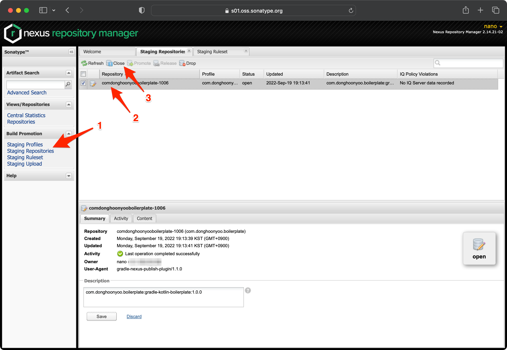
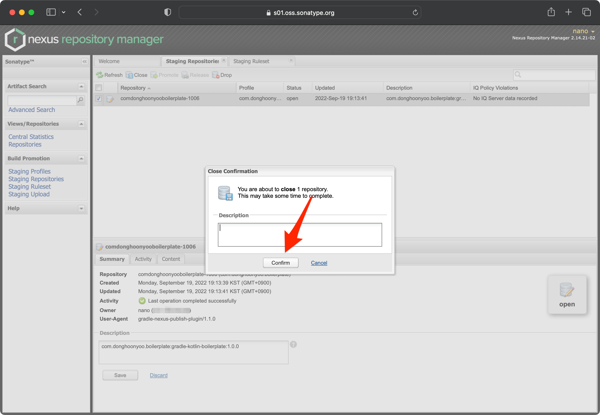
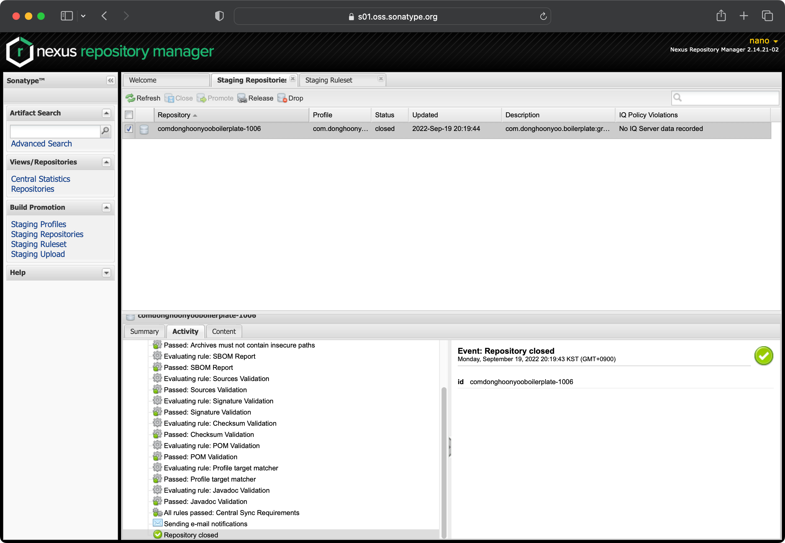

## 프롤로그

Gradle 프로젝트를 Sonatype Maven Central에 배포하는 전 과정을 정리했습니다.  
과정은 <u>배포 권한 요청</u>, <u>인증서 발급</u>, <u>Gradle 설정</u>, <u>배포</u>의 총 4가지 단계로 구성되어 있습니다.

다음은 참고 사항입니다.

- 모든 과정은 필수입니다. 과정을 임의로 생략하면 배포가 실패됩니다.
- 배포 사항이 적용되기까지 최대 수 시간이 소요됩니다.
- 배포한 내용은 수정 또는 삭제가 불가능합니다.

## 배포 권한 요청

Gradle 프로젝트를 Maven Central에 배포하는 첫 걸음은 <u>배포 권한을 요청</u>하는 것입니다. 봇이 자동으로 배포 권한을 관리하고 있기 때문에 시간이 오래 걸리지 않습니다.

1. [Sonatype Atlassian Jira](https://issues.sonatype.org/secure/Dashboard.jspa)(이하 'Jira')에 가입 및 로그인하세요. 가입 시 username은 알파벳과 숫자로만 구성해야 합니다.
1. 상단의 '만들기' 버튼을 클릭하세요.
1. '이슈 만들기' 창에 아래와 같이 기입하세요. (&lt;, &gt;는 제외해야 합니다.)
   - 프로젝트: Community Support - Open Source Project Repository Hosting
   - 이슈 유형: New Project
   - 요약: Create Repository for &lt;Gradle Project Group Id&gt;
   - 설명: &lt;Gradle Project Description&gt;
   - Group Id: &lt;Gradle Project Group Id&gt;(보유한 도메인 주소가 없다면 io.github.&lt;GitHub ID&gt;로 해도 됩니다.)
   - Project Url: 프로젝트 대표 주소(GitHub Repository 주소 권장)
   - SCM url: GitHub Repository 주소(주소는 .git으로 끝나야 합니다.)
   - Usernames: Jira 계정 이름(여러 사용자와 함께 관리하고 싶다면 관리자 모두 Jira에 가입 후 ID를 `,`으로 구분하여 입력합니다.)
   - Already Synced to Central: No
1. 봇이 아래와 같은 댓글을 작성하기를 기다립니다. 약 5분 내외의 시간이 소요됩니다.
   ```plaintext
   To register this Group Id you must prove ownership of the domain donghoonyoo.com. Please complete the following steps to continue:
   Add a DNS TXT record to your domain with the text: OSSRH-84626. Please read https://central.sonatype.org/faq/how-to-set-txt-record/
   Edit this ticket and set Status to Open.
   More info: https://central.sonatype.org/publish/
   ---
   If you do not own this domain, you may also choose a different Group Id that reflects your project hosting. io.github.donghoon-yoo would be valid based on your Project URL.
   To continue the registration process, please follow these steps:
   Create a temporary, public repository called https://github.com/donghoon-yoo/OSSRH-84626 to verify github account ownership.
   Edit this ticket, update the Group ID field with the new GroupId, and set Status to Open.
   More info: https://central.sonatype.org/publish/requirements/coordinates/
   ```
1. 보유한 도메인을 Group Id로 신청한 경우 댓글에서 지시한 도메인이 지시한 값을 포함하도록 TXT 레코드를 생성합니다. 이때 지시한 값은 댓글에도 포함되어 있는 것처럼 Issue ID와 동일합니다. 만약 자체 도메인 대신 GitHub 주소를 사용한 경우 지시한 이름의 repository를 생성합니다. 마찬가지로 지시한 이름은 Issue ID와 동일합니다.
1. 조치를 완료하였다면 Issue 상태를 다시 `열림`으로 변경하고 아무 댓글이나 작성해서 알려줍니다. 아래는 예시입니다.
   ```plaintext
   The DNS record has been added.
   ```
1. 봇이 아래와 같은 댓글을 작성하기를 기다립니다. 약 5분 내외의 시간이 소요됩니다.
   ```plaintext
   Congratulations! Welcome to the Central Repository!
   com.donghoonyoo.boilerplate has been prepared, now user(s) nano can:
   Publish snapshot and release artifacts to s01.oss.sonatype.org
   Have a look at this section of our official guide for deployment instructions:
   https://central.sonatype.org/publish/publish-guide/#deployment
   Depending on your build configuration, your first component(s) might be released automatically after a successful deployment.
   If that happens, you will see a comment on this ticket confirming that your artifact has synced to Maven Central.
   If you do not see this comment within an hour or two, you can follow the steps in this section of our guide:
   https://central.sonatype.org/publish/release/
   ######
   As part of our efforts to improve the security and quality posture of the open source supply chain,
   we plan to enable additional scanning of dependencies for security alerts soon. Since you're already
   hosting your source code in Github, you can get these insights today by enabling Sonatype Lift.
   Sonatype Lift is free forever on public repositories! Lift tells you about open source vulnerabilities
   during code review, and goes beyond open source to scan your code for both code quality and security issues,
   providing feedback right in your pull requests.
   More information can be found at https://links.sonatype.com/products/lift/github-integration
   ######
   ```
1. Jira와 동일한 계정으로 [Sonatype Nexus OSS](https://s01.oss.sonatype.org/#welcome)(이하 'Nexus')에 로그인이 잘 되는지 확인합니다.

## 인증서 발급

1. 필요한 경우 아래 방법에 따라 <u>gpg</u>를 설치하세요.
   - macOS: `brew install gpg`
   - Ubuntu: `apt-get install -y gpg`
1. 대화형 인증서 생성 명령을 입력하세요.
   ```shell
   $ gpg --full-generate-key
   ```
1. 인증서 유형으로 RSA를 선택하세요.
   ```shell
   Please select what kind of key you want:
   (1) RSA and RSA
   (2) DSA and Elgamal
   (3) DSA (sign only)
   (4) RSA (sign only)
   (9) ECC (sign and encrypt) *default*
   (10) ECC (sign only)
   (14) Existing key from card
   Your selection? 1
   ```
1. 해시 길이를 4096으로 입력하세요.
   ```shell
   RSA keys may be between 1024 and 4096 bits long.
   What keysize do you want? (3072) 4096
   ```
1. 만료 일자를 선택하세요. 자유롭게 선택해도 됩니다.
   ```shell
   Please specify how long the key should be valid.
   0 = key does not expire
   <n>  = key expires in n days
   <n>w = key expires in n weeks
   <n>m = key expires in n months
   <n>y = key expires in n years
   Key is valid for? (0) 0
   ```
1. 내용을 검토하고 `y`를 입력하세요. `n`을 입력하면 다시 처음부터 수행할 수 있습니다.
   ```shell
   Is this correct? (y/N) y
   ```
1. 필요한 정보를 입력하세요.
   ```shell
   GnuPG needs to construct a user ID to identify your key.
   Real name: DongHoon Yoo
   Email address: nano@kakao.com
   Comment: Test
   ```
1. 내용을 검토하고 `o`를 입력하세요.
   ```shell
   Change (N)ame, (C)omment, (E)mail or (O)kay/(Q)uit? o
   ```
1. 암호를 입력하세요.
1. 마지막으로 생성한 인증서의 ID를 확인하세요. ID는 해시의 뒤에서 8자리까지입니다. 만약 아래의 경우 ID는 `A8426552`입니다.
   ```shell
   $ gpg -K
    sec   rsa4096 2022-09-19 [SC]
          A031558150307D4706FD16DB408588DFA8426552
    uid           [ultimate] DongHoon Yoo (Test) <nano@kakao.com>
    ssb   rsa4096 2022-09-19 [E]
   ```
1. 원하는 위치에 인증서를 추출하세요.
   ```shell
   gpg --export-secret-keys A8426552 > ~/com.donghoonyoo.gpg
   ```
1. Keystore에 인증서를 업로드하세요.
   ```shell
   gpg --keyserver keyserver.ubuntu.com --send-keys A8426552
   ```

## Gradle 설정

1. `~/.gradle/gradle.properties`에 아래와 같이 내용을 추가하세요. Gradle 프로젝트 루트 폴더의 gradle.properties가 아닙니다. 만약 경로에 파일이 없다면 생성하세요.
   ```plaintext
   ...
   nexus.username=<Jira 계정 ID>
   nexus.password=<Jira 계정 암호>
   signing.keyId=<인증서 ID>
   signing.password=<인증서 암호>
   signing.secretKeyRingFile=<인증서 경로>
   ```
1. Gradle 프로젝트에 플러그인을 추가하세요.
   ```kotlin
   plugins {
      // ...
      id("org.jetbrains.dokka") version "1.7.10"
      id("io.github.gradle-nexus.publish-plugin") version "latest.release"
      `maven-publish`
      signing
   }
   ```
1. `sourceJar`, `javadocJar`를 추가하세요.
   ```kotlin
   val sourceJar = tasks.create<Jar>("sourceJar") {
      archiveClassifier.set("sources")
      from(sourceSets.main.get().allSource)
   }
   val javadocJar = tasks.create<Jar>("javadocJar") {
      from(tasks["dokkaJavadoc"].outputs)
      archiveClassifier.set("javadoc")
   }
   ```
1. Maven 배포 설정을 추가하세요.  
   SCM 주소, Git SCM 주소의 예시는 각각 `scm:git:git://github.com/donghoon-yoo/gradle-kotlin-boilerplate.git`, `scm:git:git://github.com/donghoon-yoo/gradle-kotlin-boilerplate.git`입니다.
   ```kotlin
   publishing {
      publications {
         create<MavenPublication>("maven") {
               artifactId = project.name
               artifact(tasks.jar.get())
               artifact(sourceJar) {
                  classifier = "sources"
               }
               artifact(javadocJar) {
                  classifier = "javadoc"
               }
               pom {
                  name.set("<프로젝트 이름>")
                  description.set("<프로젝트 설명>")
                  url.set("<프로젝트 대표 주소 또는 GitHub 주소>")
                  packaging = "jar"
                  licenses {
                     license {
                           // 라이선스는 자유롭게 변경해도 됩니다.
                           name.set("MIT License")
                           url.set("https://opernsource.org/licenses/MIT")
                     }
                  }
                  developers {
                     developer {
                           name.set("<개발자 이름>")
                           email.set("<개발자 이메일 주소>")
                     }
                  }
                  scm {
                     connection.set("<SCM 주소>")
                     developerConnection.set("<Git SCM 주소>")
                     url.set("<프로젝트 대표 주소 또는 GitHub 주소>")
                  }
               }
         }
      }
   }
   ```
1. Nexus 배포 설정을 추가하세요. 대부분의 경우 아래 내용을 그대로 복사하면 됩니다.
   ```kotlin
   nexusPublishing {
        repositories {
            sonatype {
                nexusUrl.set(uri("https://s01.oss.sonatype.org/service/local/"))
                snapshotRepositoryUrl.set(uri("https:///s01.oss.sonatype.org/content/repositories/snapshots/"))
                username.set(properties["nexus.username"] as String)
                password.set(properties["nexus.password"] as String)
            }
        }
   }
   ```
1. 인증서를 등록하세요.
   ```kotlin
   signing {
       sign(publishing.publications.findByName("maven"))
   }
   ```

## 배포

1. `:publishMavenPublicationToSonatypeRepository` Gradle task를 실행하세요.
1. 아래 그림과 같이 'Staging Repositories'에서 배포한 프로젝트를 찾아 선택한 다음 'Close'를 클릭하세요.
   
1. 아래 그림과 같이 'Confirm' 버튼을 클릭하세요.
   
1. 아래 그림과 같이 모든 테스트에서 통과되면 'Event: Repository closed'라는 메시지가 표시됩니다.
   

## 레퍼런스

- [Publishing my artifact - Getting started](https://central.sonatype.org/publish/publish-guide/)
- [The Signing Plugin](https://docs.gradle.org/current/userguide/signing_plugin.html)
